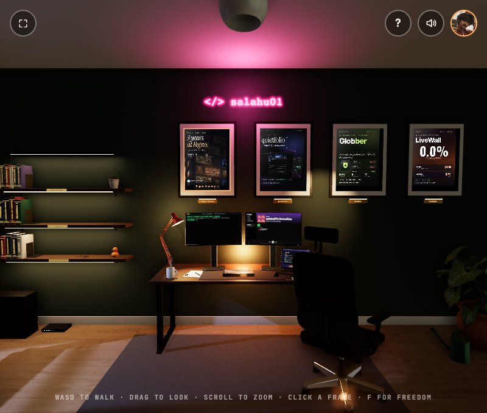

# salahu01 — Room

**Live: [salahu01.github.io](https://salahu01.github.io/)**

A walkable 3D developer room — my portfolio. Knock on the door, walk in, and click the framed screens on the wall to open my live projects.

- **Projects** (all MIT licensed, [source on GitHub](https://github.com/salahu01)): [Fegno Journey](https://salahu01.github.io/fegno-journey/) ([repo](https://github.com/salahu01/fegno-journey)) · [Quietfolio](https://salahu01.github.io/quietfolio/) ([repo](https://github.com/salahu01/quietfolio-template)) · [Globber](https://salahu01.github.io/globber/) ([repo](https://github.com/salahu01/globber-app)) · [LiveWall](https://salahu01.github.io/livewall/) ([repo](https://github.com/salahu01/livewall-app))
- **Blog:** [swalahu.netlify.app/blog](https://swalahu.netlify.app/blog)
- **Elsewhere:** [GitHub](https://github.com/salahu01) · [LinkedIn](https://www.linkedin.com/in/swalahu-cv-a98196230) · [Instagram](https://www.instagram.com/swalahu._/)

Works on laptop and phone, free, no sign-up. Built with [three.js](https://threejs.org/).

This repository holds the published build only.
